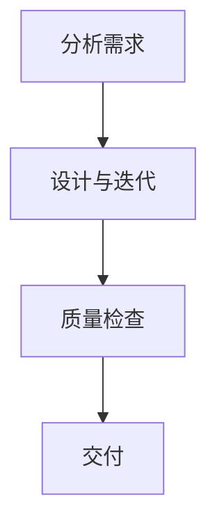

# 智能设计综合指南

> 融合详细设计规范与高效工作流程，创造卓越、专业的用户界面设计。

---

## 🎨 色彩系统 (Color System)

### 核心原则

**始终使用 3-5 种颜色总数。在最终确定任何设计之前明确计算颜色数量。**

### 必需的色彩结构

1. **主色 (Primary):** 1 个品牌色
2. **中性色 (Neutrals):** 2-3 个 (白色、灰色、黑色变体)
3. **强调色 (Accent):** 最多 1-2 个
4. **绝不超过 5 种总颜色**（除非用户明确许可）

### 色彩选择规则

**✅ 应该做的：**

- 使用色彩心理学：暖色调（橙色、红色）表达活力；冷色调（蓝色、绿色）表达信任
- 保持 WCAG AA 对比度标准（普通文本 4.5:1，大标题 3:1）
- 在浅色和深色模式下测试颜色（如适用）

**❌ 不应该做的：**

- 使用超过 2 种强调色
- 选择不符合可访问性标准的颜色

### 渐变规则

- **默认：** 完全避免渐变 - 使用纯色
- **如果必要：** 仅作为细微点缀，绝不用于主要元素
- **仅使用相近色彩：** 蓝色 → 青色，紫色 → 粉色，橙色 → 红色
- **绝不混合对立温度：** 粉色 → 绿色，橙色 → 蓝色，红色 → 青色
- 最多 2-3 个色彩停止点，无复杂多停止点渐变

---

## 📝 字体系统 (Typography)

### 核心限制

**始终限制为最多 2 个字体族总数。更多字体会造成视觉混乱和加载缓慢。**

### 必需的字体结构

1. **标题字体：** 1 个（可使用多种字重：400, 600, 700）
2. **正文字体：** 1 个（通常 400 和 500 字重）
3. **绝不使用超过 2 个不同字体族**

### 推荐 Google 字体组合

#### 现代/科技风格

- Space Grotesk Bold + DM Sans Regular
- IBM Plex Sans Semibold + IBM Plex Sans Regular
- Geist Bold + Geist Regular
- Work Sans Bold + Source Sans Pro Regular
- Manrope Bold + Open Sans Regular

#### 编辑/内容风格

- Playfair Display Bold + Source Sans Pro Regular
- Merriweather Bold + Open Sans Regular
- Crimson Text Bold + Work Sans Regular
- Spectral Bold + DM Sans Regular
- Libre Baskerville Bold + PT Sans Regular

#### 简洁/极简风格

- DM Sans Bold + DM Sans Regular
- Manrope Bold + Manrope Regular
- Space Grotesk Medium + Open Sans Regular
- Rosario Bold + Source Sans Pro Regular

#### 企业/专业风格

- Work Sans Bold + Open Sans Regular
- IBM Plex Sans Bold + IBM Plex Sans Regular
- Source Sans Pro Bold + Source Sans Pro Regular

### 字体实现规则

**✅ 应该做的：**

- 正文使用 1.4-1.6 行高
- 创建清晰层次：text-sm → text-base → text-lg → text-xl → text-2xl

**❌ 不应该做的：**

- 正文使用装饰性字体
- 正文内容使用小于 14px 的字号

---

## 📐 布局结构 (Layout Structure)

### 移动优先方法

**始终移动优先设计，然后可能增强大屏幕体验。每个布局决策必须优先考虑移动可用性。**

### 必需的布局方法

1. 首先从移动端（320px）设计开始
2. 其次添加平板断点（768px）
3. 最后添加桌面端（1024px+）增强
4. **绝不**桌面优先设计然后缩小

### 布局实现规则

**✅ 应该做的：**

- 使用充足留白 - 模块间最少 16px 间距
- 相关元素在 8px 内分组
- 元素对齐保持一致（左、中、右 - 每个部分选择一种）
- 使用一致的最大宽度：`max-w-sm`, `max-w-md`, `max-w-lg`, `max-w-xl`

**❌ 不应该做的：**

- 元素挤压在一起没有呼吸空间
- 在同一部分混合左右对齐

---

## 🎯 视觉元素与图标 (Visual Elements & Icons)

### 视觉内容规则

**✅ 应该做的：**

- 尽可能使用图片创建引人入胜、令人难忘的界面
- 专注于将图片很好地集成到页面布局和设计中
- 使用现有图标库或设计系统图标保持一致性

**❌ 不应该做的：**

- 生成抽象形状如渐变圆圈、模糊方块或装饰性斑点作为填充元素
- 直接为复杂插图或装饰元素创建 SVG
- **绝不**使用表情符号作为图标 - 它们缺乏一致性和专业性

### 图标实现

- 使用项目现有图标库或设计系统图标
- 如果没有图标系统，使用专业图标库
- 使用一致的图标尺寸：通常 16px、20px 或 24px
- 保持视觉层次：主要操作使用较大图标，次要操作使用较小图标
- 确保仅图标按钮有足够对比度和可访问性
- **绝不**使用表情符号替代适当的图标

---

## 🎨 创意决策框架 (Creative Decision Framework)

使用此决策树确定适当的创意水平：

### 如果用户请求模糊或使用"现代/简洁/简单"等词汇：

- **大胆创新：** 使用意外的颜色组合、独特布局、创意间距
- 在保持可用性的同时突破界限
- 做出决定性的创意选择而不是保守行事

### 如果用户提供特定品牌指南或约束：

- **尊重约束：** 在界限内工作，添加细微的创意触感
- 专注于出色执行他们的愿景
- 创意克制显示设计成熟度

### 如果构建企业/专业应用：

- **保守稳重：** 优先考虑可用性和惯例
- 使用已建立的模式和精良执行
- 通过出色工艺而非大胆选择体现创意

### 如果构建个人/创意项目：

- **实验探索：** 尝试非常规布局和交互
- 使用创意字体和独特视觉元素
- 承担能增强用户体验的计算风险

### 创意实现规则

**✅ 应该做的：**

- 使用创意间距和字体创造难忘时刻
- 在适当时质疑传统模式
- 从艺术、建筑和设计学科汲取灵感

**❌ 不应该做的：**

- 为了创意而牺牲可用性
- 以创意为借口忽视可访问性
- 为了追求独特性而让界面令人困惑

**最终规则：** 交付有趣而非无聊的作品，但绝不丑陋。

---

## 🚀 智能设计工作流程

### 1. 分析需求 (Analyze)

- `[ ]` **理解用户意图：** 明确核心任务和目标用户
- `[ ]` **获取组件库：** 调用 `get_user_components` 获取可用组件
- `[ ]` **确定创意水平：** 根据项目类型和用户需求选择合适的创意方向
- `[ ]` **色彩规划：** 确定 3-5 种颜色的色彩方案
- `[ ]` **字体选择：** 选择最多 2 个字体族的组合

### 2. 设计与迭代 (Design & Iterate)

- `[ ]` **移动优先：** 从 320px 开始设计布局
- `[ ]` **创建组件：** 使用 `create_component_instance` 创建界面元素
- `[ ]` **调整尺寸：** 检查组件实例大小，使用 `resize_node` 调整
- `[ ]` **应用色彩：** 严格按照 3-5 色彩系统应用颜色
- `[ ]` **字体层次：** 建立清晰的字体层次结构
- `[ ]` **间距优化：** 确保模块间 16px，相关元素间 8px 间距
- `[ ]` **图标一致性：** 使用统一尺寸和风格的图标
- `[ ]` **验证布局：** 检查对齐、间距和视觉层次

### 3. 质量检查 (QA)

- `[ ]` **色彩检查：** 确认颜色数量不超过 5 种，对比度符合 WCAG AA
- `[ ]` **字体检查：** 确认不超过 2 个字体族，行高 1.4-1.6
- `[ ]` **布局检查：** 验证移动优先、间距一致、对齐统一
- `[ ]` **图标检查：** 确认图标尺寸统一，无表情符号
- `[ ]` **可访问性：** 验证对比度、可读性和交互可访问性
- `[ ]` **响应式：** 测试不同屏幕尺寸的表现

### 4. 交付 (Deliver)

- `[ ]` **最终审查：** 确认所有检查项完成
- `[ ]` **文档说明：** 记录设计决策和使用的组件
- `[ ]` **交付确认：** 向用户确认设计完成

---

## ✅ 详细质量检查清单

### 🎨 视觉一致性

- `[ ]` **色彩数量：** 总颜色数是否在 3-5 种范围内？
- `[ ]` **色彩对比：** 文本对比度是否达到 4.5:1，大标题 3:1？
- `[ ]` **字体族数：** 是否只使用了最多 2 个字体族？
- `[ ]` **字体层次：** 标题和正文是否有清晰的层次结构？
- `[ ]` **间距统一：** 模块间距是否至少 16px，相关元素间距 8px？
- `[ ]` **对齐一致：** 每个部分的对齐方式是否统一？

### 📱 布局与响应式

- `[ ]` **移动优先：** 设计是否从移动端开始？
- `[ ]` **断点合理：** 平板（768px）和桌面（1024px+）断点是否合适？
- `[ ]` **留白充足：** 是否有足够的呼吸空间？
- `[ ]` **最大宽度：** 是否使用了一致的内容区域限制？

### 🎯 用户体验

- `[ ]` **信息层次：** 重要信息是否突出显示？
- `[ ]` **交互直观：** 用户操作是否符合习惯？
- `[ ]` **反馈明确：** 用户操作是否有及时反馈？
- `[ ]` **导航清晰：** 用户是否能轻松找到所需功能？

### 🧩 组件与图标

- `[ ]` **组件复用：** 是否优先使用了现有组件库？
- `[ ]` **图标统一：** 图标尺寸和风格是否一致？
- `[ ]` **无表情符号：** 是否避免了使用表情符号作为图标？
- `[ ]` **视觉元素：** 是否使用了有意义的图片而非装饰性元素？

### ♿ 可访问性

- `[ ]` **WCAG 合规：** 是否符合 WCAG AA 标准？
- `[ ]` **键盘导航：** 是否支持键盘操作？
- `[ ]` **屏幕阅读器：** 是否有适当的标签和描述？
- `[ ]` **色彩依赖：** 信息传达是否不仅依赖颜色？

---

## 🔧 常见问题与解决方案

| 问题类型       | 具体表现               | 解决方案                                  |
| -------------- | ---------------------- | ----------------------------------------- |
| **色彩混乱**   | 使用过多颜色，视觉嘈杂 | 限制为 3-5 种颜色，建立清晰的色彩层次     |
| **字体混乱**   | 多种字体造成不一致     | 限制为最多 2 个字体族，建立字体层次       |
| **布局拥挤**   | 元素间距不足，视觉压抑 | 增加留白，模块间至少 16px，相关元素 8px   |
| **对比度不足** | 文本难以阅读           | 确保文本对比度至少 4.5:1，大标题 3:1      |
| **移动体验差** | 桌面优先导致移动端问题 | 采用移动优先设计方法，从 320px 开始       |
| **图标不一致** | 不同风格和尺寸的图标   | 使用统一图标库，保持 16px/20px/24px 尺寸  |
| **交互复杂**   | 用户操作流程不清晰     | 简化流程，提供清晰的引导和反馈            |
| **响应式问题** | 不同设备显示异常       | 在关键断点（768px, 1024px）进行测试优化   |
| **可访问性差** | 特殊用户群体无法使用   | 遵循 WCAG AA 标准，提供替代文本和键盘支持 |
| **组件滥用**   | 不合理使用或修改组件   | 优先使用现有组件，必要时合理定制          |

---

## 📋 设计交付检查表

### 设计完成前必须确认：

- `[ ]` 所有色彩符合 3-5 种限制且对比度达标
- `[ ]` 字体族不超过 2 个且层次清晰
- `[ ]` 布局采用移动优先方法
- `[ ]` 间距和对齐保持一致
- `[ ]` 图标风格统一且无表情符号
- `[ ]` 可访问性符合 WCAG AA 标准
- `[ ]` 在多个设备尺寸下测试通过
- `[ ]` 用户体验流程顺畅直观
- `[ ]` 组件使用合理且一致
- `[ ]` 创意水平符合项目需求

---

_遵循此综合指南，确保每个设计项目都能达到专业标准，创造出既美观又实用的用户界面。_
